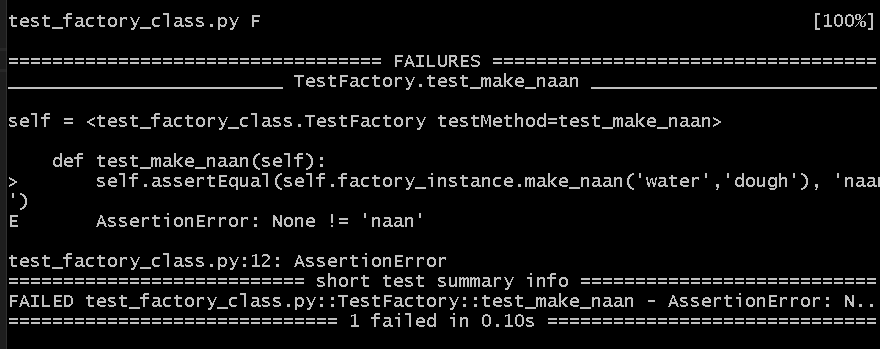
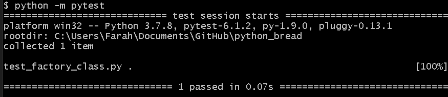

# Python TDD Task - Bread 

## Task 
__User Stories__:
1. As a user, I can use the make dough with 'water' and 'flour' to make 'dough'.
2. As a user, I can use the bake dough with dough to get naan.

3. As a user, I can user the run factory with water and flour and get naan.

## Pre-Requisites
__Necessary:__ You must have python installed.  
__Optional:__ It is easier to complete this task when using a code editor, such as Visual Studio Code or PyCharm. You can learn how to [install VSC](https://docs.microsoft.com/en-us/visualstudio/install/install-visual-studio?view=vs-2019) or [install PyCharm](https://www.jetbrains.com/help/pycharm/quick-start-guide.html) using these hyperlinks. 

## Steps:
### 1. In a `test_factory_class.py` file, import the necessary modules:
```python
# import necessary files and modules
from factory_class import Factory 
# this class doesn't exist yet so it's important to remember to keep this name
# when we make the class later
import unittest
import pytest
```
### 2. Create a test class and a method to check whether our to-be-created class meets our requirements:
```python
# creating testing class, it is a child of unittest.TestCase
class TestFactory(unittest.TestCase):

    # instantiating the class so we can test it 
    factory_instance = Factory()

    # test fails when the outcome of the funciton is not 'naan', provided the input is 'water' and 'bread'
    def test_make_naan(self):
        self.assertEqual(self.factory_instance.make_naan('water','bread'), 'naan')
```

### 3. In a new file called `factory_class.py` create a Factory class and pass for now.
```python
class Factory:
    pass
```
### 4. Save your files then, in your terminal, test your class: 
Use the command `python -m pytest`in your terminal to test your code. Note: you should be in the directory where your files for this tasks are stored. The test should `fail` because we have not met the requirements yet.



### 5. Let's build our class to be able to meet these requirements, still in the factory_class.py file: 
```python
# creating Factory class
class Factory:
    
    # make dough function takes water & bread and returns dough. 
    def make_dough(self, water_string, bread_string):
        # makes sure if the input is not 'water' and 'bread'
        if water_string == 'water' and bread_string == 'bread':
            return 'dough'
        
    # make naan function takes outcome of make_dough function and makes naan with it
    def make_naan(self,water_string, bread_string):
        # works if make_dough returned dough
        if self.make_dough(water_string, bread_string) == 'dough':
            return 'naan'
```
### 6. Let's test our function against our requirements:
Again, in your terminal type `python -m pytest`, and if nothing is wrong you should see this result.

